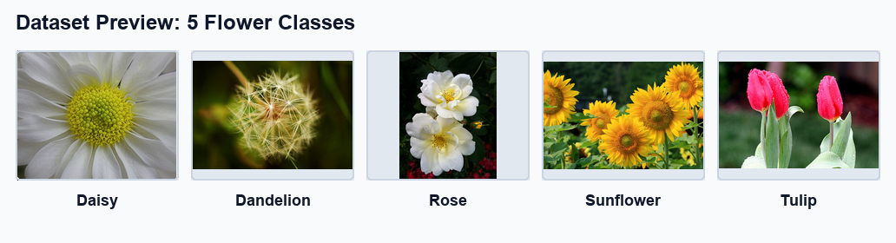
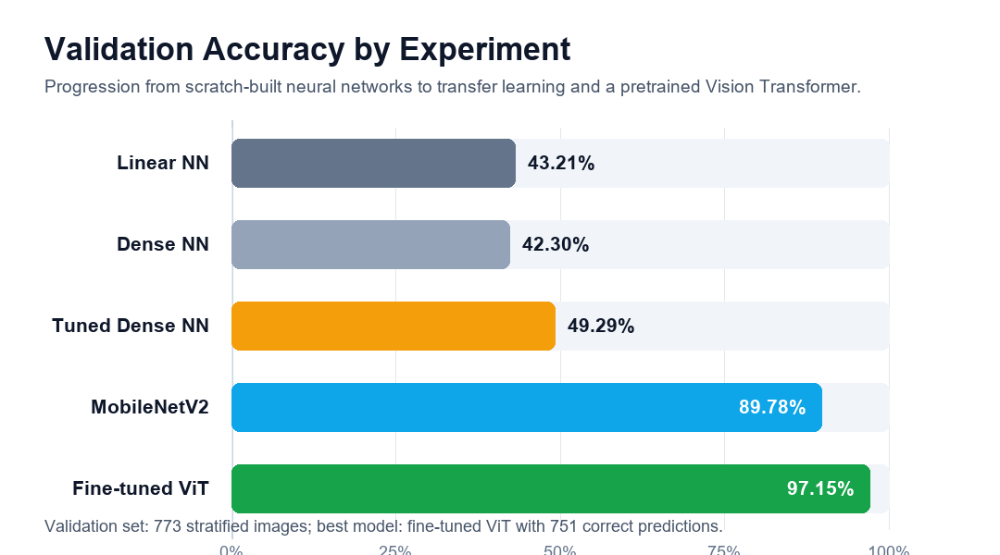
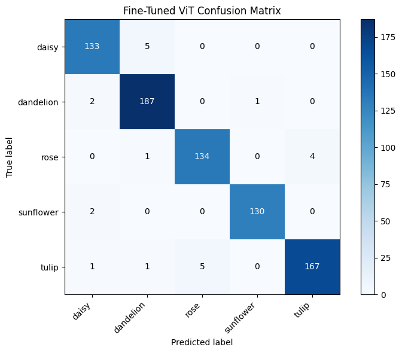
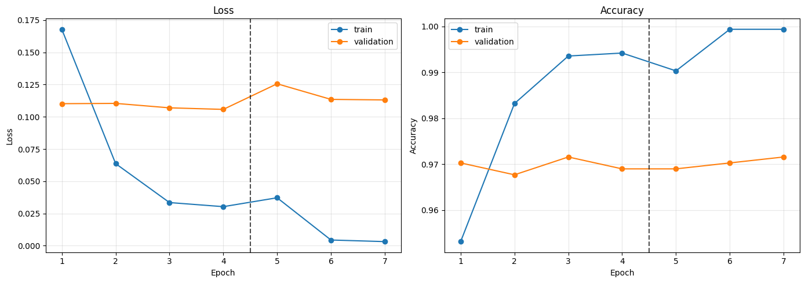
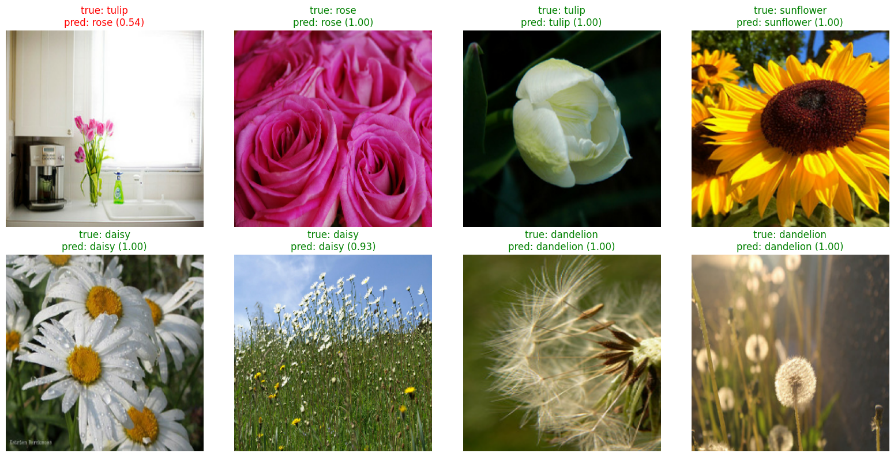

# 5-Class Flower Image Classification

Computer vision project comparing neural-network baselines, tuned dense models, transfer learning, and a pretrained Vision Transformer for classifying flower images into five classes: daisy, dandelion, rose, sunflower, and tulip.

The final model is a partially fine-tuned ViT that reached **97.15% validation accuracy** with **751 correct predictions out of 773 validation images**.



## Results at a Glance



| Stage | Notebook | Model | Main idea | Validation accuracy |
| --- | --- | --- | --- | --- |
| EXP1 | [Simple Linear NN](EXP1_SimpleLinearNN.ipynb) | Flatten + softmax classifier | Establish a scratch-built baseline | 43.21% |
| EXP2 | [Simple Nonlinear NN](EXP2_SimpleNonLinearNN.ipynb) | Flatten + dense ReLU layer | Add nonlinearity and capacity | 42.30% |
| EXP3 | [Tuned Dense NN](EXP3_SimpleNonLinearWithHPT_BatchNormalization_EarlyStopping_Regularization_Dropout.ipynb) | Dense NN with batch norm, dropout, L2, early stopping | Manual grid search over batch size, learning rate, hidden nodes, dropout, and L2 | 49.29% |
| Level 2 | [Transfer Learning](Level2_TransferLearning.ipynb) | Fine-tuned MobileNetV2 | Reuse ImageNet visual features and fine-tune the top layers | 89.78% |
| Level 3 | [Transformer Classification](Level3_TransformerBasedImageClassification.ipynb) | Fine-tuned ViT | Use a pretrained Vision Transformer and unfreeze the top transformer blocks | **97.15%** |

## Best Model Detail

The selected final model is the fine-tuned Vision Transformer from `Level3_TransformerBasedImageClassification.ipynb`.

| Metric | Value |
| --- | ---: |
| Validation accuracy | 97.15% |
| Correct validation predictions | 751 / 773 |
| Validation mispredictions | 22 |
| Frozen ViT feature-extractor accuracy | 96.90% |
| Fine-tuning gain | +0.26 percentage points |



The most common remaining confusions are between visually similar flower classes such as daisy vs. dandelion and rose vs. tulip.





## What This Project Shows

- Built a full TensorFlow image-classification pipeline from local image folders.
- Created a stratified 80/20 validation split for consistent experiment comparison.
- Compared simple baselines, a tuned neural network, MobileNetV2 transfer learning, and a pretrained ViT.
- Used regularization, batch normalization, dropout, early stopping, learning-rate reduction, and model checkpoints.
- Preserved notebook outputs, confusion matrices, prediction previews, and submission CSVs so results are visible directly in GitHub.

## Dataset

| Split / class | Count |
| --- | ---: |
| Labeled images | 3,865 |
| Training split | 3,092 |
| Validation split | 773 |
| Test images | 400 |
| Daisy | 691 |
| Dandelion | 951 |
| Rose | 694 |
| Sunflower | 659 |
| Tulip | 870 |

The validation split is stratified and reproducible. The generated split files are available as:

- [train_set.csv](5-flowers-image-classification/train_set.csv)
- [val_set.csv](5-flowers-image-classification/val_set.csv)

## Repository Tour

| Path | Purpose |
| --- | --- |
| [Project2_Report.pdf](Project2_Report.pdf) | Formal project report and experiment writeup |
| [EXP1_SimpleLinearNN.ipynb](EXP1_SimpleLinearNN.ipynb) | Scratch linear baseline |
| [EXP2_SimpleNonLinearNN.ipynb](EXP2_SimpleNonLinearNN.ipynb) | Scratch nonlinear baseline |
| [EXP3_SimpleNonLinearWithHPT_BatchNormalization_EarlyStopping_Regularization_Dropout.ipynb](EXP3_SimpleNonLinearWithHPT_BatchNormalization_EarlyStopping_Regularization_Dropout.ipynb) | Tuned dense model with regularization |
| [Level2_TransferLearning.ipynb](Level2_TransferLearning.ipynb) | MobileNetV2 transfer learning and fine-tuning |
| [Level3_TransformerBasedImageClassification.ipynb](Level3_TransformerBasedImageClassification.ipynb) | ViT feature extraction and partial fine-tuning |
| [5-flowers-image-classification](5-flowers-image-classification) | Image dataset, prediction submissions, and train/validation split CSVs |
| [docs/assets](docs/assets) | README visuals extracted from the notebook outputs |

## How to Run

```powershell
python -m venv .venv
.\.venv\Scripts\Activate.ps1
pip install -r requirements.txt
jupyter lab
```

Open the notebooks from the repository root. They use `5-flowers-image-classification/` as the dataset folder, with fallbacks for the original local project path.

## Final Submission Files

- [submission_simple_flatten.csv](5-flowers-image-classification/submission_simple_flatten.csv)
- [submission_simple_nonlinear.csv](5-flowers-image-classification/submission_simple_nonlinear.csv)
- [submission_simple_nonlinear_best_config.csv](5-flowers-image-classification/submission_simple_nonlinear_best_config.csv)
- [submission_mobilenetv2_transfer_learning.csv](5-flowers-image-classification/submission_mobilenetv2_transfer_learning.csv)
- [submission_vit_flower_classifier.csv](5-flowers-image-classification/submission_vit_flower_classifier.csv)

## Tech Stack

Python, TensorFlow/Keras, Hugging Face Transformers, NumPy, Matplotlib, Pillow, Jupyter Notebook.
